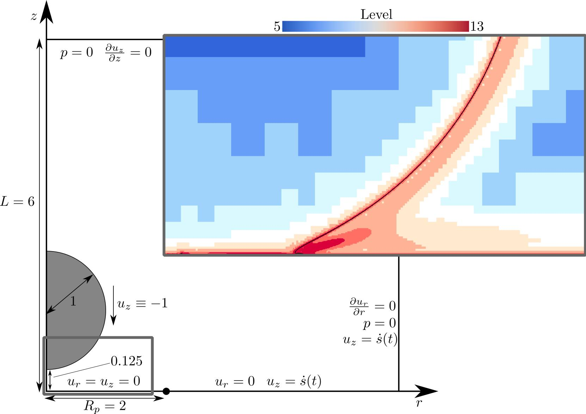

Code for conducting direct numerical simulations for droplet impact onto 
spring-supported plates using [Basilisk](<http://basilisk.fr/>). Used in 
producing the results for our recent paper [Droplet impact onto a spring-supported plate: analysis and simulations](<https://link.springer.com/article/10.1007/s10665-021-10107-5/>) in the Journal of Engineering Mathematics.

Contributors: [Michael Negus](<https://www.maths.ox.ac.uk/people/michael.negus>), [Radu Cimpeanu](<https://warwick.ac.uk/fac/sci/maths/people/staff/cimpeanu/>), [Matthew Moore](<https://www.hull.ac.uk/staff-directory/matthew-moore>), [James Oliver](<https://www.maths.ox.ac.uk/people/james.oliver>)




# Installation
* A recent installation of [Basilisk](<http://basilisk.fr/>) is required to run 
the simulations, see [here](<http://basilisk.fr/src/INSTALL>) for installation
instructions for Basilisk. 
* The [additional packages for visualisation](<http://basilisk.fr/src/gl/INSTALL>) 
are also required if you wish to produce movies of the simulations, however this
option can be turned off if you do not wish to install the additional packages.
* An installation of [gfsview](http://gfs.sourceforge.net/wiki/index.php/Main_Page) 
is also recommended for visualising the gfs_output files.
* Most of the data analysis files are written in MATLAB, however the data 
output of the Basilisk scripts are in a general form that any data analysis
toolset can be used.

# A mathematical note on coordinates and time
These simulations take place within an axisymmetric framework with coordinates
(r, z). In Basilisk, the axisymmetric coordinates are given by x = z, y = r, 
so within the code keep in mind that, counter-intuitively, the vertical direction
is given by x and the radial by y.

In addition, the time coordinates in the paper are scaled such that t = 0 at the
time of impact. Within the simulations, the droplet is initialised at a height
given by `INITIAL_DROP_HEIGHT` at `t = 0`, so the impact time is at `t = INITIAL_DROP_HEIGHT`.
This means when comparing the computational and analytical solutions, the 
computational time will need to be adjusted by this amount.  

# Tutorial
Below we give a brief tutorial as to how to run a simulation. Although not strictly
required, familiarity with Basilisk (at least up until the point you can run
the [tutorial](<http://basilisk.fr/Tutorial>) is very useful. 

## Example run
As an example, the code in the `example_run` directory is immediately ready to be
run. In the command line, enter the directory `example_run/code` and run the command
```shell
./run_simulation droplet_impact_plate 
```
After a bunch of text initialising the Makefiles, you should eventually see
```shell
[droplet_impact_plate.tst]
```
which indicates the code is running! This example will run the simulation for 
a maximum refinement level of 6, with plate parameters `ALPHA = 2`, `BETA = 0` and 
`GAMMA = 500` up until `t = 0.8`. During run-time, the output will be in a directory
called `droplet_impact_plate`, and if you want to check how things are going then
open the file named `log`, which will output various quantities for `t += 1e-4`. 

Calling the above command will run the code on one core only, which is very 
slow! To run the code on `N` cores, you need to run
```shell
./run_simulation droplet_impact_plate N
```
It is recommended to make `N` a power of 2 (e.g. 2, 4, 8, 16, ...) for optimal
load balancing. The time it takes to run will depend on your computational setup,
but for 4 cores you can expect the run to take around 20 minutes. Because of this,
it is wise to make the simulation run in the background, to prevent losing your
progress if you close the terminal window. To do this, run the command
```shell
nohup ./run_simulation droplet_impact_plate N &
```
Here the command `nohup` sends what would have been outputted to the command line 
into a file called `nohup.out`, and the & sign suppresses the terminal output. This
means that the code is running in the background and you can safely close all 
terminal windows. When you run this command, you'll get a command line message 
that looks something like
```shell
[1] 22791
nohup: ignoring input and appending output to 'nohup.out'    
```
In this case, the PID of the process is 22791. It is worth noting this, as if you
wish to end the process early, you'll need to use the command
```shell
kill -s TERM 22791   
```
where of course replace the 22791 with the PID you were given.

At the end of the simulation, all of the output will be moved into a directory
called `raw_data` in the example_run directory, so the contents of example_run are
the code and the `raw_data` directories. We'll discuss what to do with this data
in the following sections. 

## Specifying your own parameters
The example code runs the code with a relatively coarse grid (with `MAXLEVEL = 6`,
while the results in the paper have `MAXLEVEL = 13`). In order to change parameters 
such as the maximum refinement level, you need to edit the values in the `parameters.h`
file found in the `utility_scripts` directory. This script contains all of the
parameters used in the code, both physical parameters like the properties of the
plate, and computational parameters like the refinement level.

In its current form, the parameters script is set up with the values that were
used to produce the results in the paper. In terms of computational options such
as the refinement level, things should be kept the same. However note that with
`MAXLEVEL = 13`, the code takes about 8 hours to run on 8 cores, so this may want
to be reduced while getting to grips with the code. 

The main parameters that you'd want to change are the plate parameters `ALPHA`, 
`BETA` and `GAMMA`, as these change the properties of the plate as seen in the figures
in the paper. As well as these, it is also important to run the control case, where
the plate is held stationary. In this case, you'd set the `CONST_ACC` flag to 1,
which will set the acceleration of the plate to the constant value given by 
`PLATE_ACC`. If `PLATE_ACC = 0` (as it is by default), then the plate will be 
stationary and this will provide the parameters for the test case.

Apart from these, feel free to look at the other parameters listed in `parameters.h`, 
and find out how they're used in the `droplet_impact_plate.c` script. 

Once you've set the parameters as desired in `parameters.h`, you'd want to run the
code! First, you'll need to copy the scripts into a different directory on your
system (preferably one with plenty of disk space). Say you want to run your
code in a folder called `myRun` inside a parent directory called `parentDir`; then 
enter the `utility_scripts` directory and run the command
```shell
./code_copy.sh ../droplet_impact_plate parentDir myRun
```
This will create a directory called `myRun` inside `parentDir`, and inside `myRun`
there will be a sub-directory called code containing the scripts: `droplet_impact_plate.c`, 
`Makefile`, `parameters.h` and `run_simulation.sh`. This is the exact setup that
was in your original `example_run/code` directory. This script is ready to be
run in the exact way you did for the example, and running 
```shell
nohup ./run_simulation droplet_impact_plate N &
```
should kick off the simulation! 

## Understanding the data output
The simulations produce a lot of data output, and on their own they can be
confusing and disorganised! Once the simulation has finished, all of these output
files are left in the `raw_data` directory. Here we detail what these files are:
* **log**  
The log file outputs the relevant global quantities for `t += 1e-4`. Specifically,
these are:
    - `F`: The unfiltered force on the plate at time `t`
    - `force_term`: The force term after filtering
    - `avg`: The average force over the last `PEAK_LAG` timesteps
    - `std`: The standard deviation of the force over the last `PEAK_LAG` timesteps
    - `s`: The plate position
    - `ds_dt`: The first time derivative of the plate position
    - `d2s_dt2`: The second time derivative of the plate position
The log file is in a readable form, but will need to be cleaned to use in post-processing
(see later in this section).
* **mp4 files**    
Simply, if you've chosen to output movies, then movies of the process will be 
produced in a bunch of mp4 files. These are the easiest ways to visualise the
simulation.
* **gfs files**  
These files with a .gfs extension are files that can be opened using gfsview (if
you have installed it). I.e. to open the `gfs_output_1.gfs`, call `gfsview2D gfs_output_1.gfs`. 
See the Gerris website for more details on how to work gfsview. 
* **interface_N.txt**  
At regular intervals, the interface of the droplet is outputted into the
`interface_N.txt` files, where N is incrememented. These files contain the start
and end points coordinates of each line segment along the interface. This can
either be used to visualise the interface in a ``smart" way by drawing the line 
segments, or just producing a scatter plot out of all of the points.
* **plate_output_N.txt**  
At regular time intervals, these files output the pressure `p` and viscous stress
`strss` along the plate at x = 0 (i.e. z) for various y (i.e. r). In its
raw form these are in a readable format, and after cleaning these can be
used to visualise the evolution pressure and viscous stress in post-processing/


### Data cleaning
As mentioned, the `log` and `plate_output_N.txt` files are in a human-readable
form, which is no good for post-processing. You can clean these scripts by going
 into the `utility_scripts` directory and
running the command 
```shell
./output_clean.sh dir
```
where `dir` is the address to the directory where the `code` and `raw_data`
directories are. To try this out, you can run this command for the example run. 
This command will move some of the data from the `raw_data` directory into new
directories that make it easier to access, such as moving the mp4 files into the
`movies` directory and the gfs files into a `gfs_files` directory, and move the 
`log` file into the parent directory. It also creates a new `cleaned_data` 
directory, where the file `output.txt` is the `log` file after removing all of 
the non-numeric text, and similarly the `plate_outputs` directory contains 
cleaned versions of all of the `plate_output_N.txt` files. These are less human-readable,
but are in a form where you can use post-processing. For example, you can
call MATLAB's `readmatrix` function directly onto any of these files to get a 
matrix with the same rows and columns as these text files.

## Post-processing
After cleaning the data, you should be ready to analysis the data in post-processing.
There are many scripts for this in the `data_analysis` directory, however these
currently have not been organised very well. It may instead be best to write your
own post-processing scripts with your language of choice, as this is the best way
to get to grips with the output, however if you get stuck then exploring the
contents of `data_analysis` may help.


# Further questions
If you get stuck at any point, then please do reach out via email, where my 
address is given on my GitHub profile. Otherwise the Basilisk website has plenty
of documentation and an active forum page that are always happy to help. Good luck!